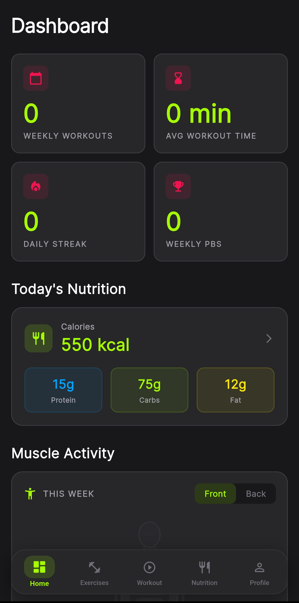
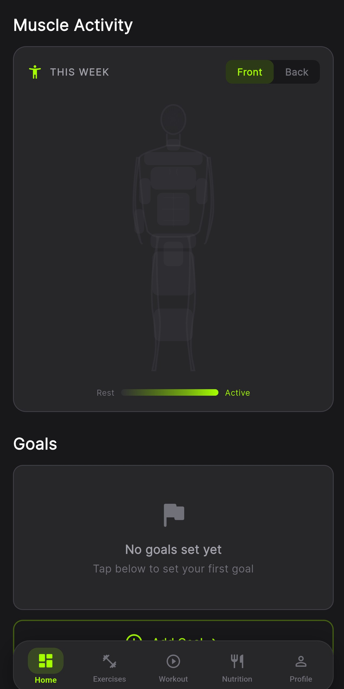
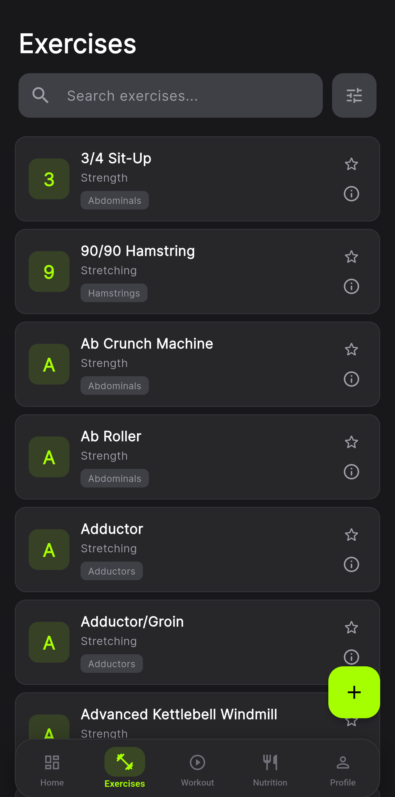
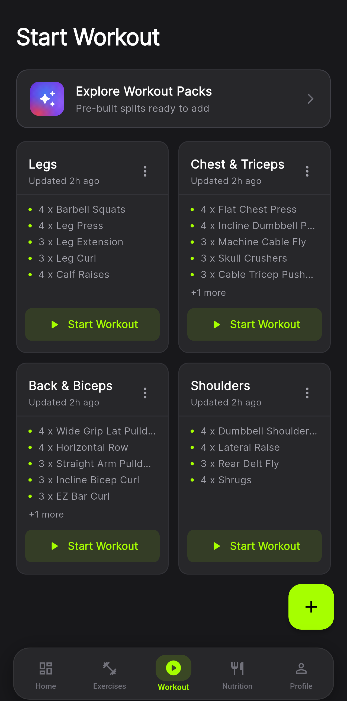
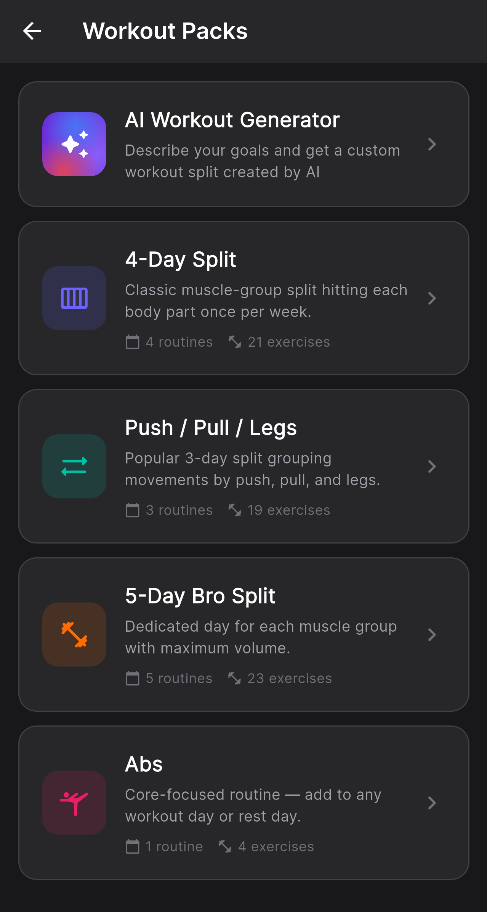
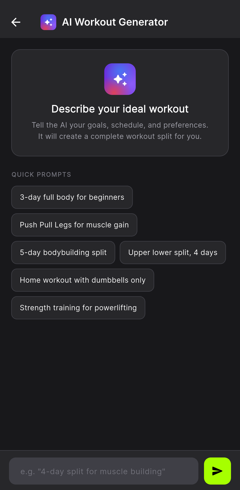
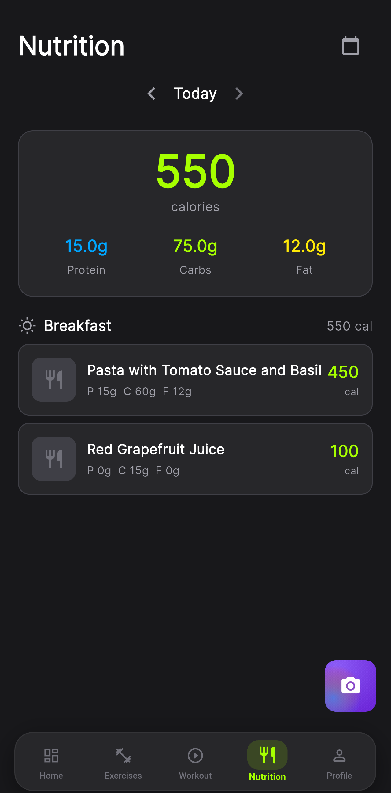
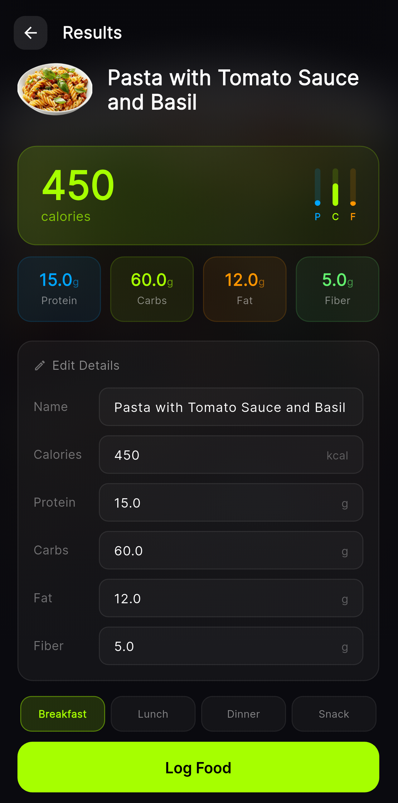
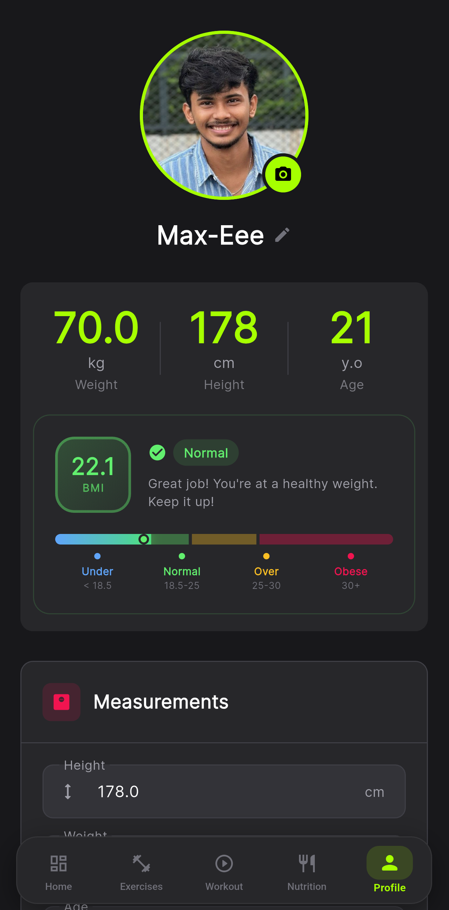
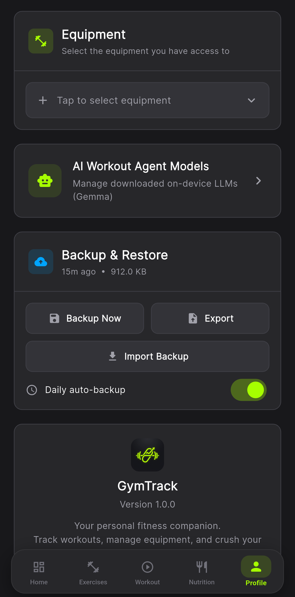

# <i>**`GymTrack`** Personal Fitness & AI Trainer</i>

> **Offline-first Architecture** - 100% On-Device execution to ensure maximum privacy

This application is for fitness enthusiasts tracking workouts, managing custom exercises, and utilizing **`On-Device AI Models (Gemma)`**, **`Voice Commands`**, `AI calorie Tracker` using `Image`, and generate routines with `Natural Language`.

### [**No subscriptions. No trackers. Just gains.**](#) 🏋️‍♂️

<samp>
  
> [!IMPORTANT]
> **Privacy First**: No server required! All AI interactions, voice processing, and database syncing occur completely locally on your device.
> 
> **Heavy Gemmqa 4 AI Models**: The on-device LLM functionality requires downloading large models for using AI features.  
> 

## 📸 Preview

  
  
  
  
  
  
  
  
  
  
  

## ✨ Features

### Core Tracking Engine
- **`Workout Sessions`** : Build, track, and save workouts with custom sets and rest timers.
- **`Custom Exercises`** : Break free from restricted databases by logging your own variations.
- **`Extensive Charts`** : Leverage detailed historical data visualization for progressive overload.
- **`Offline Backup & Restore`** : Manually export your `.db` files or schedule simple daily auto-backups.

### On-Device AI Features
- **`Everything Runs Locally`** : Your workout data never leaves your device.
- **`Gemma Integration`** : Powered by Google Gemma - download LiteRT models straight to the device!
- **`AI Voice Assistant`** : Talk to your app to log sets effortlessly without typing.
- **`Workout Chatbot`** : Discuss exercise tweaks and replacements with a built-in virtual fitness assistant.

## ⬇️ Installation

1. [Download](https://github.com/Max-Eee/GymTrack/releases/download/v1.0.0/app-release.apk) pre built file.
2. Or clone the repo
3. Ensure you have the `Flutter SDK` (v3.5+) and Android Studio installed.
4. Open your terminal and run `flutter pub get` inside the project root.
5. Connect an Android device (Android 12+ recommended).
6. Run `flutter build apk --release` to compile your GymTrack build.

## 💻 Usage

### Initializing the App:
1. Open GymTrack from your mobile device.
2. The initial database seed will execute seamlessly, inserting hundreds of base exercises.
3. Navigate to **Settings** -> **AI Models**.
4. Download and activate your preferred local Gemma model for Chatbot and Voice capabilities.
5. Create a new Workout, configure your sets, and start lifting!

> [!NOTE]
> **Voice Capabilities**: Ensure you have granted Microphone permissions if you plan on logging your sets using hands-free AI voice parsing.

## 🤝 Contribute

If you want to contribute to the GymTrack experience, follow these steps:

1. Fork this repository
2. Make your targeted code additions (e.g. extending chart capabilities or adding more default exercises)
3. Create a pull request to contribute your additions back to the main repository

This helps expand GymTrack and keeps the open-source fitness community thriving!

## 💬 Feedback

We'd love to hear your thoughts! If you encounter any issues parsing workouts with voice tracking or have suggestions for UI improvement, please reach out. 💌

## License

This project is licensed under the MIT License - see the [LICENSE](LICENSE) file for details.

</samp>
